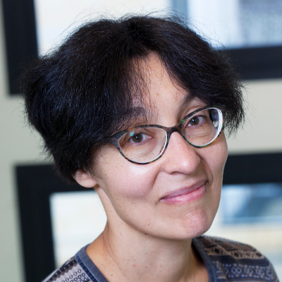
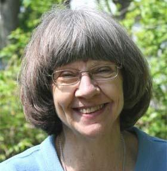
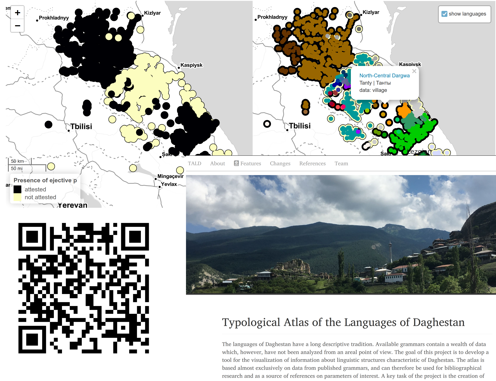
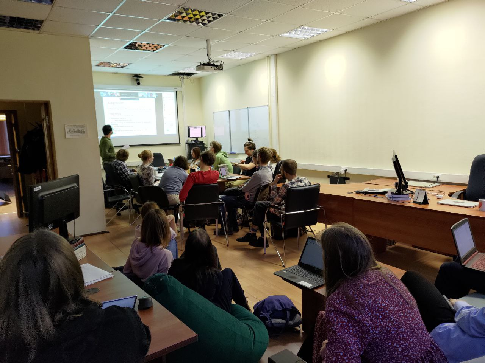

```{r, include=FALSE}
knitr::opts_chunk$set(echo = FALSE, warning = FALSE, message = FALSE, dev='cairo_pdf')
library(tidyverse)
theme_set(theme_minimal()+theme(legend.position = "bottom", text = element_text(size = 26)))
```

## О лаборатории

* Открыта в 2017 году

```{r, out.width="40%", fig.cap="Н. Р. Добрушина и Дж. Николс", fig.show='hold', fig.align='center'}


```

Оба исследователя специализируются на славянских языках и языках Кавказа, а также лингвистической типологии

* C июля 2022 новый заведующий

## Миссия

Исследование механизмов конвергентных процессов в истории языка, то есть языковых ситуаций, при которых контакт между носителями разных языков ведет к появлению у этих языков общих черт. В лаборатории разрабатываются инструменты для выявления результатов таких процессов по данным электронных корпусов устной речи и создаются каталоги таких явлений на материале малых языков России.

## Состав

```{r}
read_csv("data/n_people.csv") %>% 
  pivot_longer(names_to = "var", values_to = "value", n_people:phd) %>% 
  mutate(var = case_when(var == "n_people" ~ "всего сотрудников", 
                         var == "phd" ~ "канд. наук/PhD")) %>% 
  ggplot(aes(year, value, label = value, group = var, fill = var))+
  geom_line()+
  geom_point(shape = 22, size = 7)+
  geom_label(size = 10, show.legend = FALSE)+
  scale_fill_manual(values = c("lightblue", "darkseagreen3"))+
  labs(x = "", y = "", fill = "", color = "")
```

## Основные проекты

```{r, out.width="110%"}
knitr::include_graphics("images/03_projects.png")
```

## [Типологический атлас языков Дагестана](lingconlab.ru/dagatlas)

- 48 глав, описывающих грамматические особенности языков Дагестана, каждая глава
  - прошла рецензирование
  - содержит набор стандартизированных динамических карт

```{r, out.width="80%", fig.align='center'}

```

## [Диалектные устные корпуса русского языка](http://lingconlab.ru/resources.html)

- 15 диалектных устных корпусов русского языка
- 7 устных корпусов билингвального русского

```{r, out.width="100%", fig.align='center'}
knitr::include_graphics("images/05_corpus.png")
```

## 152 семинаров за 2017--2022

- Еженедельные [англоязычные семинары](https://ilcl.hse.ru/seminars), вторник 16:00, Б-421

```{r, out.width="90%", fig.align='center'}

```

## Школы, круглые столы, экспедиции

- Онлайн школа по Нахско-дагестанским языкам (на английском языке, открытая, онлайн), 24 лекции, более 100 участников, почти 8 тысяч просмотров, см. на нашем [youtube-канале](https://www.youtube.com/@linguisticconvergencelabor7318/)
- Онлайн курс по азербайджанскому Мурада Сулейманова (École Pratique des Haute Études, 2020)
- Международный воркшоп “Emerging Topics in Typology” (между 25 октября и 22
ноября 2021, онлайн)
- Воркшоп “Spatial and social separation of speech communities and language
change” на 55-ом съезде европейского лингвистического общества (24–27 августа 2022,
Бухарест)
- Два выезда [Российского общества полевых лингвистов](https://opling.github.io/) (март и октябрь 2022)
- Около 20 экспедиций по исследованию малых языков и сбору данных в Дагестан, Адыгею, Карачаево-Черкесию, Кабардино-Балкарию, Чукотку и Сахалин \pause
- Планируем в следующем году устроить школу по корпусным исследованиям

## Экспедиции

```{r, out.width="90%", fig.align='center', fig.cap="Фотография М. Даниэля"}
knitr::include_graphics("images/08_expedition.jpg")
```

## {}

\LARGE Спасибо за внимание!
